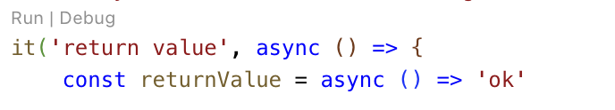

# NEST-SEED

NestJS 기반 프로젝트 시작을 위한 통합 템플릿으로, 다음과 같은 핵심 기능을 제공합니다:

- **Docker 기반 개발 환경**: 컨테이너화된 완전한 개발 환경을 지원합니다.
- **데이터베이스 통합**: MongoDB 및 Redis에 대한 사전 구성된 설정을 포함합니다.
- **테스트 커버리지**: 모든 코드에 Jest 기반 단위/통합 테스트 코드를 제공합니다.
- **고성능 테스트 실행**: Jest의 병렬 실행 기능을 활용해 빠른 테스트 수행이 가능합니다.
- **계층화 아키텍처**: 관심사 분리를 위한 3-Layer 아키텍처를 적용했습니다.
- **MSA 지원**: NATS 메시지 브로커를 활용한 마이크로서비스 아키텍처 기반 구성이 가능합니다.
- **E2E 테스트 자동화**: Bash 스크립트 기반의 종단 간 테스트 시스템을 구축했습니다.
- **설계 문서화**: PlantUML로 작성된 상세 아키텍처 다이어그램을 포함합니다.

## 1. 요구사항

이 프로젝트를 실행하기 위해서는 호스트 환경에 다음과 같은 필수 구성 요소가 필요합니다:

- **CPU**: 4코어 이상
- **메모리**: 16GB 이상
    - 16GB 미만이라면 Jest 실행 시 `--runInBand` 옵션을 사용해 메모리 사용량을 줄일 수 있습니다.
    - CPU 코어 수가 메모리에 비해 많다면 `jest.config.ts`에서 `maxWorkers` 값을 `(RAM / 4)`로 조정하는 것을 권장합니다. (예: 8GB RAM 환경이면 2 workers 설정)
- **Docker**
- **VSCode 및 확장 프로그램**
    - Dev Containers (ms-vscode-remote.remote-containers)

> Windows 환경에서는 호환성 문제가 생길 수 있으므로, VMware로 Ubuntu를 구동한 뒤 그 안에서 VSCode를 사용하는 방식을 권장합니다.

## 2. 프로젝트의 구성

이 프로젝트는 영화 예매 시스템을 설계 및 구현해서 회원 가입과 같은 기본적인 기능을 템플릿으로 제공하기 위해서 만들어졌습니다.
이 프로젝트는 3~4인으로 이루어진 소규모 팀을 가정하였습니다. 프로젝트와 팀의 규모가 커지면 그에 맞게 프로젝트가 재구성 되어야 합니다.
예를 들어, 지금은 applications 프로젝트에 booking과 같은 여러 개의 서비스가 포함되어 있지만 규모가 커지면 한 개의 서비스가 한 개의 프로젝트로 구성되어야 할 수 있습니다.

```
.
├── scripts
│   ├── common.cfg
│   ├── reset-infra.sh
│   ├── run-apps.sh
│   ├── run-cli.sh
│   ├── run-test.sh
│   └── workspace-cleanup.sh
├── src
│   ├── apps
│   │   ├── __tests__
│   │   ├── applications
│   │   │   └── services
│   │   │       ├── booking
│   │   │       ├── purchase-process
│   │   │       ├── recommendation
│   │   │       └── showtime-creation
│   │   ├── cores
│   │   │   └── services
│   │   │       ├── customers
│   │   │       ├── movies
│   │   │       ├── purchases
│   │   │       ├── showtimes
│   │   │       ├── theaters
│   │   │       ├── ticket-holding
│   │   │       ├── tickets
│   │   │       └── watch-records
│   │   ├── gateway
│   │   │   └── controllers
│   │   ├── infrastructures
│   │   │   └── services
│   │   │       ├── payments
│   │   │       └── storage-files
│   │   └── shared
│   │       ├── config
│   │       ├── modules
│   │       └── pipes
│   └── libs
│       ├── common
│       └── testlib
└── test
    ├── e2e
    └── fixtures
```

## 3. 프로젝트 이름 변경

원하는 프로젝트 이름으로 변경하려면 다음 설정을 검토하고 수정합니다:

- .env.test
- package.json
    - name
- src/apps/shared/config/etc.ts
    - ProjectName

## 4. 실행 환경

이 프로젝트에서 사용하는 인프라의 버전을 변경하려면 다음 설정을 검토하고 수정합니다:

- .env.infra
    ```
    MONGO_IMAGE=mongo:8.0
    REDIS_IMAGE=redis:7.4
    NATS_IMAGE=nats:2.10-alpine
    APP_IMAGE=node:22-alpine
    ```
- .devcontainer/Dockerfile
    ```docker
    FROM node:22-bookworm
    ```
- .github/workflows/test-coverage.yaml
    ```yaml
    jobs:
    test-coverage:
        runs-on: ubuntu-24.04-arm
        container: node:22-bookworm
    ```

## 5. 테스트의 실행

이 프로젝트는 MSA와 TDD를 지향하며 개발 과정에서 프로젝트를 직접 실행할 일이 많지 않습니다. 그래서 프로젝트 설정도 이에 맞춰서 구성되어 있습니다. 이유는 다음과 같습니다.

- MSA와 monorepo로 구성되어 있기 때문에 한 개의 프로젝트를 실행하려면 관련된 여러 개의 다른 프로젝트를 모두 실행해야 합니다. 프로젝트가 커질수록 이것은 힘든 작업입니다.
- 모의 사용을 최소화 해서 작성한 jest 테스트는 버튼 한 번만 누르면 모든 프로젝트를 실행하고 자동으로 실제와 가까운 테스트를 합니다. 프로젝트를 직접 실행할 필요가 없습니다.

테스트를 실행하는 방법은 다음과 같습니다.

- 유닛 테스트는 VSCode에 "Jest Runner" extension 설치 및 code lens 옵션이 활성화 되어있다면, Jest 테스트에 대해 "Run | Debug" 메뉴가 나타납니다.
    
    - "Run"을 클릭하면 자동으로 테스트를 실행합니다. "Run" 모드로 테스트를 실행하면 콘솔창에 로그를 출력하지 않습니다.
    - "Debug"를 클릭하면 디버거를 자동으로 연결하고 테스트를 실행합니다. "Debug" 모드로 테스트를 실행하면 콘솔창에 로그를 출력합니다.
- End-to-End 테스트는 bash 스크립트로 작성했습니다. End-to-End는 프로젝트의 빌드부터 실행까지 모두 테스트 합니다.
    - Run `npm run test:e2e`

## 6. 실행과 디버깅

- 호스트에서 [git credentials](https://code.visualstudio.com/remote/advancedcontainers/sharing-git-credentials) 설정 후, vscode에서 Reopen container를 실행하면 실행 환경이 자동으로 구성됩니다.
- 개발 환경을 초기화 하려면 vscode의 View -> Command Palette -> Dev Containers: Rebuild Container를 실행합니다.
- 개발 환경 실행 구성은 /.vscode/tasks.json에 정의되어 있습니다.
- 디버깅 구성은 /.vscode/launch.json에 정의되어 있습니다.

## 7. 빌드

제품을 빌드하고 실행하려면 docker에 대한 지식이 필요하다. 상세 정보는 다음을 참고한다:

- Dockerfile
- docker-compose.yml

## 8. 그 외

1. 본 문서에서 다루지 않는 중요 정보는 아래 문서에 정리했다.
    - [Design Guide](./docs/guides/design.guide.md)
    - [Implementation Guide](./docs/guides/implementation.guide.md)
2. "PlantUML Preview"에서 md 파일 내 UML 다이어그램을 보려면 커서가 `@startuml`과 `@enduml` 사이에 있어야 합니다.
3. UML 다이어그램이 "Preview markdown"에서 나타나지 않으면 보안 설정이 필요할 수 있습니다.
    - 미리보기 화면 오른쪽 상단의 "..." 버튼을 클릭하여 "미리보기 보안 설정 변경"을 선택하세요.
