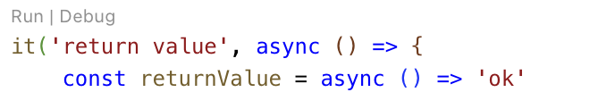
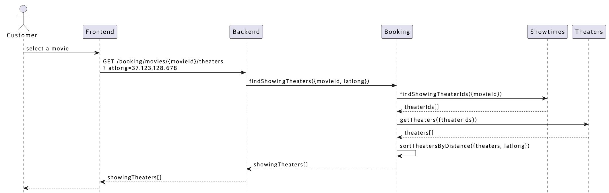

> 🇺🇸 [View in English](../README.md)

# NEST-MSA

Nest로 구현된 영화 예매 시스템의 백엔드 예제 프로젝트입니다. 주요 특징은 다음과 같습니다:

- **Docker 기반 개발 환경**: 컨테이너를 활용해 일관된 개발 환경을 제공합니다.
- **데이터베이스 통합**: MongoDB 및 Redis에 대한 사전 설정을 포함합니다.
- **테스트 커버리지 확보**: Jest 기반의 단위 및 통합 테스트 코드를 제공합니다.
- **고성능 테스트 실행**: Jest의 병렬 실행 기능으로 테스트 속도를 향상시켰습니다.
- **계층화 아키텍처**: 관심사를 분리한 3-Layer 아키텍처를 적용했습니다.
- **MSA 지원**: NATS 메시지 브로커 기반의 마이크로서비스 아키텍처를 지원합니다.
- **E2E 테스트 자동화**: Bash 스크립트를 활용한 종단 간 테스트 환경을 구축했습니다.
- **설계 문서 포함**: PlantUML로 작성된 아키텍처 다이어그램이 포함되어 있습니다.

> 이 프로젝트는 `Microservices Architecture`입니다. `Monolithic Architecture`는 [nest-mono](https://github.com/mannercode/nest-mono) 프로젝트를 참조하세요.

## 1. 시스템 요구 사항

이 프로젝트를 실행하려면 다음과 같은 호스트 환경이 필요합니다:

- **CPU**: 4코어 이상
- **메모리**: 16GB 이상 권장
    - 16GB 미만인 경우, Jest 실행 시 `--runInBand` 옵션 사용을 권장합니다.
    - CPU 코어 수가 많은 경우, `jest.config.ts`에서 `maxWorkers`를 `(RAM / 4)`로 설정하는 것을 추천합니다. (예: 8GB RAM → 2 workers)
- **Docker**
- **VSCode 및 확장 프로그램**
    - Dev Containers (ms-vscode-remote.remote-containers)

> Windows 환경은 호환성 이슈가 발생할 수 있으므로, VMware로 Ubuntu를 실행한 후 그 안에서 VSCode를 사용하는 방식을 권장합니다.

## 2. 프로젝트 이름 변경

원하는 프로젝트 이름으로 변경하려면 다음 파일의 설정을 수정하세요:

- `.env.test`
- `package.json`
    - `name`
- `src/apps/shared/config/etc.ts`
    - `ProjectName`

## 3. 개발 환경 구성

### 3.1 개발 환경 설정

1. 호스트에서 [Git credentials](https://code.visualstudio.com/remote/advancedcontainers/sharing-git-credentials)를 설정합니다.
2. VSCode에서 "Reopen in Container" 명령을 실행해 환경을 자동으로 구성합니다.

### 3.2 환경 초기화

1. VSCode 메뉴 → "View" → "Command Palette" → `Dev Containers: Rebuild Container` 실행

### 3.3 언어 설정

기본적으로 이 프로젝트는 한국어 환경으로 설정되어 있습니다. 다른 언어를 사용하려면 다음 내용을 수정하세요:

```dockerfile
# .devcontainer/Dockerfile
# for Korean
RUN apt-get install -y locales \
    && sed -i '/ko_KR.UTF-8/s/^# //g' /etc/locale.gen \
    && locale-gen ko_KR.UTF-8 \
    && update-locale LANG=ko_KR.UTF-8

ENV LANG=ko_KR.UTF-8 \
    LANGUAGE=ko_KR:ko \
    LC_ALL=ko_KR.UTF-8
```

### 3.4 개발 인프라 구성

개발용 인프라 설정을 변경하려면 다음 파일들을 수정하세요:

- `.env.infra`
    ```env
    MONGO_IMAGE=mongo:8.0
    REDIS_IMAGE=redis:7.4
    NATS_IMAGE=nats:2.10-alpine
    APP_IMAGE=node:22-alpine
    ```
- `.devcontainer/Dockerfile`
    ```dockerfile
    FROM node:22-bookworm
    ```
- `.github/workflows/test-coverage.yaml`
    ```yaml
    jobs:
        test-coverage:
            runs-on: ubuntu-24.04-arm
            container: node:22-bookworm
    ```

### 3.5 테스트 인프라 구성

테스트 환경은 실제 운영 환경과 유사하게 Docker 기반의 MongoDB, Redis, NATS를 사용합니다. 이를 통해 얻는 장점은 다음과 같습니다:

- **운영 환경 유사성 확보**: 운영 시 발생 가능한 오류를 조기에 발견할 수 있습니다.
- **간단한 설정**: 추가 라이브러리 학습 없이 테스트 환경 구성이 가능합니다.

> 반복 테스트 시 MongoDB의 메모리 사용량 증가로 인해 간헐적인 실패 가능성이 있습니다. 그래서 전체 테스트 실행 전 인프라를 초기화 하도록 스크립트를 구성했습니다.
>
> 자세한 사항은 `scripts/run-test.sh` 파일을 참고하세요.

## 4. 통합 테스트 및 디버깅

통합 테스트는 MSA 및 TDD 기반 개발을 효율적으로 지원합니다. 모의(Mock)를 최소화하고 실제 서비스 조합을 테스트합니다.

### 4.1 통합 테스트 실행 방법

1. VSCode에서 `Jest Runner` 확장을 설치합니다. 테스트 코드 상단에 `Run | Debug` 버튼이 나타납니다.

    - **Run**: 테스트 실행 (로그 출력 없음)
    - **Debug**: 디버거 연결 후 실행 (로그 출력 가능)
    - 버튼이 보이지 않는 경우: Code Lens 옵션 활성화 필요

    

2. CLI에서 `npm test` 실행:

    ```sh
    npm test

    > nest-msa@0.0.1 test
    > bash scripts/run-test.sh

    Select Test Suites
    > all
      apps
      common
    Enter number of runs (default 1):
    ```

### 4.2 테스트 실패 시 대처 방법

실행 환경에 따라서 테스트가 실패할 수 있습니다. 램과 CPU 코어 수가 영향을 미치기도 합니다. 만약 테스트 실패의 원인이 명확하지 않다면 다음과 같이 설정을 조정해 보세요.

```ts
// jest.config.ts
testTimeout: 60 * 1000
maxWorkers: 1
```

> 32GB/8코어 환경에서 단독 실행 시 5초 내 완료되는 테스트가, 병렬 실행 시에는 `testTimeout` 값을 초과해 실패하는 경우가 있었습니다.

## 5. 서비스 실행 및 디버깅

이 프로젝트는 마이크로서비스 구조 특성상, 각 서비스를 따로 실행하기보다 통합 테스트를 활용해 검증하는 방식이 효율적입니다. 그럼에도 불구하고 특정 서비스를 단독으로 실행해 디버깅해야 한다면, 다음 설정을 참조하세요:

- `/.vscode/launch.json`

## 6. 빌드 및 E2E 테스트

다음 명령어로 전체 빌드 및 종단 간 테스트를 실행할 수 있습니다:

```sh
npm run test:e2e
```

사용되는 설정 파일:

- `./Dockerfile`
- `./docker-compose.yml`
- `./scripts/run-apps.sh`

## 7. 프로젝트 구조

현재는 소규모 팀(3~4인)을 기준으로 4개의 프로젝트(`gateway`, `applications`, `cores`, `infrastructures`)로 구성되어 있으며, 필요 시 각 서비스를 독립 프로젝트로 분리해 확장 가능합니다.

### 7.1 폴더 구성

```text
src
├── apps                  # 각종 서비스 애플리케이션
│   ├── __tests__         # 통합 테스트
│   ├── applications
│   │   └── services
│   │       ├── booking             # 티켓 예매
│   │       ├── purchase-process    # 결제 처리
│   │       ├── recommendation      # 추천 서비스
│   │       └── showtime-creation   # 상영시간 생성
│   ├── cores
│   │   └── services
│   │       ├── customers         # 고객 인증/관리 (Mock 기반 테스트, password 숨김, 서비스 분리)
│   │       ├── movies            # 영화 관리 (파일 업로드 포함)
│   │       ├── purchases         # 구매 관리
│   │       ├── showtimes         # 상영 시간 관리 (다양한 쿼리)
│   │       ├── theaters          # 극장 관리 ('name' 인덱스 적용)
│   │       ├── ticket-holding    # 티켓 선점 관리
│   │       ├── tickets           # 티켓 관리 (배열 유효성 검증 포함)
│   │       └── watch-records     # 관람 기록 관리
│   ├── gateway           # REST API 진입점
│   │   └── controllers
│   ├── infrastructures   # 외부 서비스 연동
│   │   └── services
│   │       ├── payments         # 결제 시스템 연동
│   │       └── storage-files    # 파일 저장소 연동
│   └── shared            # 공통 코드
│       ├── config
│       ├── modules
│       └── pipes
└── libs                  # 범용 공통 라이브러리
    ├── common
    └── testlib
```

## 8. 설계 문서

설계 문서는 `PlantUML`을 사용해 작성되었으며, `./docs/designs` 경로에 있습니다.

- VSCode 확장: `PlantUML (jebbs.plantuml)` 설치 필요
- 미리보기 시 커서가 `@startuml`과 `@enduml` 사이에 있어야 합니다
- 보안 설정이 필요한 경우: 우측 상단 `...` → `미리보기 보안 설정 변경`

예시:



## 9. 추가 문서

아래 문서에서 구현 및 설계에 대한 더 자세한 정보를 확인할 수 있습니다:

- [Design Guide](./ko/guides/design.guide.md)
- [Implementation Guide](./ko/guides/implementation.guide.md)
