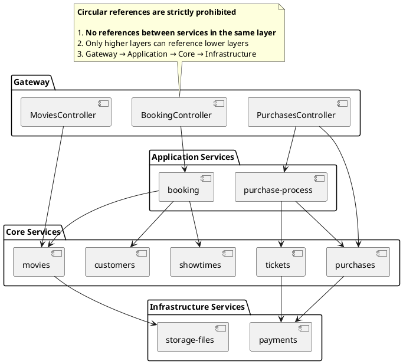

# Design Guide

This document outlines the rules applied during the design process.



## 1\. Prohibition of Circular References

### 1.1. Unidirectional Dependency

All services (modules/classes) are designed to have **unidirectional dependencies** to prevent circular dependency issues.

This means only services in lower layers can be referenced, and any form of reference between services in the same layer is not allowed.

This prevents circular dependency problems that tend to arise as the structure becomes more complex.

[This project reflects these guidelines in its `index.ts` implementation.](./implementation.guide.md#5-import)

### 1.2. Separation of Controllers

> This explanation applies to the monolithic structure project [nest-mono](https://github.com/mannercode/nest-mono).

The `nest-mono` project adopts a different architectural approach compared to the standard Nest(NestJS) structure to prevent circular dependency issues.

Nest typically uses the `Feature Module` approach, bundling `Controller`, `Service`, and `Repository` into a single module.
However, this approach can easily lead to [circular dependency problems](./problems-with-feature-modules.md) because `Controller` often references multiple services.

To prevent this, `nest-mono` explicitly separates `Controller`s into a `Controllers` folder within the traditional monolithic structure, clearly distinguishing them from `Service`s.

This structure reduces coupling between services and provides **scalability for migrating from a monolith to an MSA, allowing the `Controllers` folder to be directly converted into a `Gateway` module.**

## 2\. Service Structure

### 2.1. Separation of Services

Services in this project are broadly divided into `Application`, `Core`, and `Infrastructure`.

- **Application Service**:
    - Orchestrates user scenarios (e.g., order → payment → notification).
    - Only allowed to call Core/Infra services.
    - Leads transaction management.
- **Core Service**:
    - Handles core domain logic (e.g., movie management, theater management).
    - Only allowed to call Infra services.
- **Infrastructure Service**:
    - Handles integration with external systems like DBs, payments, storage.

### 2.2. Service Invocation

> This explanation applies to the microservices structure project [nest-msa](https://github.com/mannercode/nest-msa).

When a REST API is called, the service is executed through the following 4 steps, as shown in the diagram below:


```
apps
├── gateway
│   └── controllers
│       └── #1 movies.controller.ts
│
└── cores
    └── services
        └── movies
            ├── #2 movies.client.ts
            ├── #3 movies.controller.ts
            └── #4 movies.service.ts
```

### 2.3. Service Naming

Process-centric services are named using singular nouns.

1.  BookingService: Handles the ticket booking process.
2.  PurchaseProcessService: Handles the purchase process.
3.  RecommendationService: Recommends content.

Entity management services are named using plural nouns.

1.  MoviesService: Manages movie entities.
2.  TheatersService: Manages theater entities.
3.  TicketsService: Manages ticket entities.

## 3\. REST API

### 3.1. Choosing Between GET and POST

A request to retrieve information for 10,000 users at once is too large to be passed using the GET method.

```sh
GET /users?user-id=userid1,userid2,userid3 ...
```

In cases like this, where a `GET` or `DELETE` method results in an excessively long query, use `POST` as shown below:

```sh
# Find
GET /movies?...
# Execute find
POST /movies/find

# Delete
DELETE /movies?...
# Execute delete
POST /movies/delete
```

While the POST method usually implies `Create`, it is sometimes used to signify **executing a function**.

Consider the following when choosing between GET and POST:

- GET is suitable when:
    - Data to be transferred is small and simple.
    - Caching is required.
    - Bookmarking or sharing the URL via the address bar is needed.
- POST is suitable when:
    - Data to be transferred is large or complex (e.g., files, long text).
    - Data is sensitive (e.g., passwords, personal information).
    - The operation modifies the server's state (e.g., creating, modifying resources).

### 3.2. Limitations on Self-Descriptive APIs

Fully implementing HATEOAS (Hypermedia as the Engine of Application State) for self-description is difficult and complex.
It's more efficient to provide only simple links and explain complex APIs through documentation.

Rather than trying to completely replace documentation, writing code that outputs more detailed error information is more productive.

```json
// Example of typical HATEOAS
{
    "results": [
        {
            "_expandable": {
                "children": "/rest/api/content/98308/child",
                "history": "/rest/api/content/98308/history"
            },
            "_links": {
                "self": "http://localhost:8080/confluence/rest/api/content/98308",
                "webui": "/pages/viewpage.action?pageId=98308"
            }
        }
    ]
}
```

## 4\. Error Message

### 4.1. Basic Principles

- Must include a **language-neutral `code`**.
    - Example: ERR_FILE_UPLOAD_MAX_COUNT_EXCEEDED
    - Multilingual support is the client's responsibility, so the server doesn't need to specifically handle user language information.
- The `message` is provided for reference and should be brief (clients can translate or change it internally).
- Include the `code` only when the HTTP Status is in the 4xx range.
    - 5xx errors indicate server failures, so detailed causes should not be exposed to the client.

### 4.2. Location of Error Code Definitions

- Define errors closest to the code (module/class/function) where they occur.
    - Example: `MulterConfigServiceErrors`, `MulterExceptionFilterErrors`, etc., are defined within their respective modules.
- These distributed error codes can be consolidated into a single object (e.g., `GatewayErrors`).
    - This consolidated object is used directly in tests.
    - It's also useful for providing a list of error codes to the frontend.

Example:

```ts
export const MulterConfigServiceErrors = {
    InvalidFileType: {
        code: 'ERR_FILE_UPLOAD_INVALID_FILE_TYPE',
        message: 'File type not allowed.'
    }
}

export const MulterExceptionFilterErrors = {
    MaxCountExceeded: {
        code: 'ERR_FILE_UPLOAD_MAX_COUNT_EXCEEDED',
        message: 'Too many files'
    },
    MaxSizeExceeded: {
        code: 'ERR_FILE_UPLOAD_MAX_SIZE_EXCEEDED',
        message: 'File too large'
    }
}

export const GatewayErrors = {
    FileUpload: {
        ...MulterExceptionFilterErrors,
        ...MulterConfigServiceErrors
    }
}
```

### 4.3. Consolidated Definition vs. Compromise

- **Consolidated Definition (Centralized)**
    - Manage all error messages in a single file (e.g., `gateway-errors.ts`).
    - This can become inconvenient as the number of distributed services increases.
- **Distributed Definition with Consolidated Reference (Hybrid Approach)**
    - Define error codes within each module and finally merge them into `GatewayErrors` or similar.
    - This maintains module independence while allowing clients to access error codes through a consistent interface.

## 5\. API Argument Handling

### 5.1 APIs Accepting Only IDs as Arguments

Simple lookup/delete APIs that only require IDs should be designed to handle **multiple items** by default.

If initially designed to handle only single objects, needing to handle multiple objects later requires adding new APIs or modifying existing ones, which is inconvenient. Therefore, designing them to accept an array of IDs from the start is better for scalability.

### 5.2 APIs Accepting Various Values as Arguments

For operations like create/update that require various values in the request, design them to handle a **single object**.

The structure for handling multiple objects versus a single object differs significantly for these types of APIs, so it's better to separate them based on the use case.

```ts
// Recommended approach
getTheaters(theaterIds: string[]) {}
deleteTheaters(theaterIds: string[]) {}

// Not recommended
getTheater(theaterId: string) {}
deleteTheater(theaterId: string) {}
```

However, REST APIs often involve requests for single objects. Therefore, implement them as follows, accepting a singular argument (e.g., from the path) and internally using the plural argument version:

```ts
@Get(':theaterId')
async getTheater(@Param('theaterId') theaterId: string) {
    // Internally calls the method designed for multiple IDs
    return this.theatersService.getTheaters([theaterId])
}

@Delete(':theaterId')
async deleteTheater(@Param('theaterId') theaterId: string) {
    // Internally calls the method designed for multiple IDs
    return this.theatersService.deleteTheaters([theaterId])
}
```

## 6\. Message Broker

> This explanation applies to the microservices structure project [nest-msa](https://github.com/mannercode/nest-msa).

### 6.1 Reason for Choosing NATS

After reviewing several message brokers supported by Nest(NestJS), NATS was selected.

- NATS is actively developed and supported.
- Using NATS JetStream offers the potential to replace Kafka for logging systems.
- Easy performance scaling.
- Lightweight, making it suitable for both production and development environments.

### 6.2. Reasons for Excluding Kafka

Kafka was also considered as a message broker but was not chosen for the following reasons:

- **`kafkajs` Performance Issues**

    A significant issue occurs with the `maxWaitTimeInMs` setting.
    `kafkajs` continuously checks for messages in an infinite loop, and if none are found, it sleeps for `maxWaitTimeInMs`. Consequently, when running and terminating Jest tests, there's a mandatory wait time equal to `maxWaitTimeInMs`.
    This means even simple tests take at least `maxWaitTimeInMs` to complete. The infinite loop structure itself is detrimental to performance. Furthermore, `kafkajs` appears to have ceased maintenance in 2022.

- **Topic Creation Issues During Testing**

    When initializing the Kafka container for testing, topics must be created beforehand. For example, if the Customer service defines a `getCustomer` message, two topics (`getCustomer` and `getCustomer.reply`) are needed. Creating a single topic takes several seconds, so the waiting time increases significantly with the number of topics. This problem is particularly acute in `nest-msa` where the infrastructure is initialized when running the entire test suite.

- **High Memory Usage**

    Kafka requires a minimum configuration of 3 brokers and 3 controllers, with each container consuming about 1GB of memory. While this might not be a major issue in production, it poses a burden on local development environments.

### 6.3. Other Message Brokers

The following brokers were also reviewed but not selected for these reasons:

- MQTT: Optimized for resource-constrained environments like IoT devices, but may lack performance for large-scale systems.
- RabbitMQ: Configuration and management are complex, especially when implementing clustering or high availability (HA).
