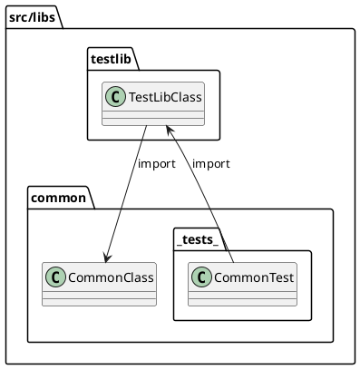

# Implementation Guide

This document outlines the rules applied during the implementation process.

## 1. Naming Rules

### 1.1. find vs get

The handling differs for functions named `find...` versus `get...` when the requested resource is not found.

```ts
// Returns null if the corresponding Seed is not found.
findSeed(seedId: string)

// Throws an exception if the corresponding Seed is not found.
getSeed(seedId: string)
```

`find` implies that **the target might not exist**, so it returns `null`.

However, `get` implies **retrieving a target that must exist**, so throwing an exception if the resource is missing is appropriate.

### 1.2. Avoid Mentioning Arguments in Function Names

Reflecting arguments in the function name makes the function less flexible and harder to read.

```ts
// Avoid writing argument information directly into the function name.
findTheatersForMovie(movieId)

// Instead, receive arguments as an object like below.
findTheaters({ movieId })
```

## 2. Relationship between TypeORM and Domain Entities

The following is example code implementing a typical entity.

```ts
@Entity()
export class Seed extends TypeormEntity {
    @Column()
    name: string

    @Column({ type: 'text' })
    desc: string

    @Column({ type: 'integer' })
    integer: number

    @Column('varchar', { array: true })
    enums: SeedEnum[]

    @Column({ type: 'timestamptz' })
    date: Date
}
```

Although the `Entity` code and `TypeORM` code (which belongs to the `Infrastructure` layer) are mixed, the entity itself does not directly reference `Infrastructure` code.
Furthermore, TypeORM's `@Column` decorator is for data mapping and does not directly affect domain logic.

Consequently, adding some `TypeORM` code to the domain object is a convenient way to connect both sides. `TypeORM` depends on the entity, but the entity is kept independent of `TypeORM`, maintaining a structure that is largely acceptable from a `DDD` perspective.

## 3. import

Assume the following folder/file structure:

```
src
├── controllers
│   ├── index.ts
│   ├── auth.controller.ts
│   └── users.controller.ts
└── services
    ├── auth
    │   ├── index.ts
    │   ├── auth.service.ts
    │   └── strategies
    └── users
        ├── index.ts
        ├── users.repository.ts
        └── users.service.ts

```

To avoid circular references, adhere to the following rules:

- Do not import from direct ancestor folders using absolute paths.

    ```ts
    /* users.service.ts */

    // (X) Potential circular dependency
    import { AuthService } from 'src/services'

    // (O) Reference using relative path
    import { AuthService } from '../auth'
    ```

- Use absolute paths for folders that are not direct ancestors.

    ```ts
    /* users.controller.ts */

    // (O) Use absolute path
    import { AuthService } from 'src/services'

    // (X) Not recommended via relative path
    import { AuthService } from '../services'
    ```

> The practice of exporting multiple modules together using `index.ts` is called Barrel import.\
> This project uses `index.ts` in each folder, which helps detect circular references more quickly.

## 4. Circular Reference between testlib and common

The `src/libs` folder contains `testlib` and `common`. At first glance, this might seem like a circular reference structure.

- Basically, `testlib` imports `common`.
- `common` also has a **tests** folder, which might contain code that imports `testlib`.

However, the **tests** folder is only for internal testing of that module and is not referenced by the actual application logic. Therefore, this interdependency does not cause conflicts at runtime, meaning no actual circular reference problem occurs.



## 5. Dynamic Import in Tests

Since the same NATS server is shared across multiple tests, `process.env.TEST_ID` is used to generate a unique subject for each test.

The problem is that due to Jest's module caching, the `@MessagePattern` decorator is evaluated only once when the module is loaded. Therefore, modules already imported at the top level do not recognize the new `process.env.TEST_ID` value.

To solve this, `resetModules: true` is applied in the Jest configuration to reset the module cache for each test.

```ts
// Using type-only imports allows bringing in types without runtime impact.
import type { Fixture } from './customers.fixture'

describe('Customers', () => {
    let fix: Fixture

    beforeEach(async () => {
        // Dynamically import the fixture setup within beforeEach
        const { createFixture } = await import('./customers.fixture')
        fix = await createFixture()
    })
})
```

## 6. entry file

The root of each project contains the following files:

- development.ts
- main.ts
- production.ts

Typically, `main.ts` would be the entry file, but in this project, `development.ts` or `production.ts` are used as the actual entry files.
This is to avoid the complexity of using multiple `conditional statements (if)` based on `process.env.NODE_ENV` within `main.ts`.

Below are related example configurations:

```json
// package.json
"scripts": {
    "build": "nest build ${TARGET_APP} -b webpack",
    "debug": "nest start ${TARGET_APP} --watch",
}
```

```json
// nest-cli.json
"projects": {
    "gateway": {
        "type": "application",
        // Entry file set to development.ts (or production.ts)
        "entryFile": "apps/gateway/development",
        "sourceRoot": "src"
    }
}
```

```json
// webpack.config.js
    const output = {
        ...options,
        // Webpack entry points to the production-specific file for builds
        entry: path.resolve(dirname, 'production.ts'),
    }
```

## 7. Separating Test Code into .spec.ts and .fixture.ts

Putting all Fixture setup code into `.spec.ts` makes it difficult to understand what the actual test logic is verifying. Therefore, test logic is concentrated in `.spec.ts`, while resources and configurations needed for the test are placed in `.fixture.ts`.

Example: Common code is gathered in the `src/apps/__tests__/utils` folder, and within that, `clients.ts` pre-fetches necessary `Service instances` using `module.get()`. This makes tests more concise and reduces code duplication.

If a new service is added and tests are written for it, files like `clients.ts` and `create-all-test-contexts.ts` etc., need to be modified.

```ts
// Example from src/apps/__tests__/utils/clients.ts
import { CustomersClient, MoviesClient } from 'apps/cores'
import { HttpTestContext, TestContext } from 'testlib'

// Defines the structure of providers available in tests
export class AllProviders {
    customersClient: CustomersClient
    moviesClient: MoviesClient
    // ... other clients/providers
}

// Function to retrieve service instances from the test module
export async function getProviders(coresContext: TestContext): Promise<AllProviders> {
    const { module: coresModule } = coresContext
    const customersClient = coresModule.get(CustomersClient)
    const moviesClient = coresModule.get(MoviesClient)
    // ... get other clients/providers

    return { customersClient, moviesClient /*, ... */ }
}
```
