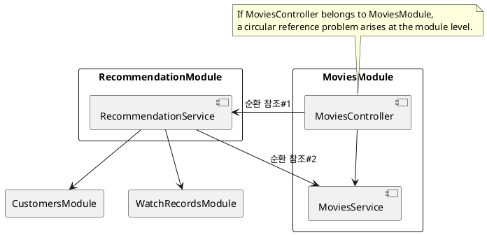
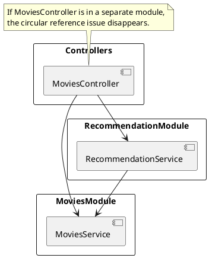

# Problems with Feature Modules

In Nest, the structure that places Controllers, Services, and Repositories within a single module is called a `Feature Module`. The [Nest official documentation](https://docs.nestjs.com/modules#feature-modules) describes this structure as follows:

> In our example, the CatsController and CatsService are closely related and serve the same application domain.
> It makes sense to group them into a feature module.
> A feature module organizes code that is relevant to a specific feature, helping to maintain clear boundaries and better organization.
> This is particularly important as the application or team grows, and it aligns with the SOLID principles.

However, the Feature Module structure has a disadvantage in that it can more easily lead to `circular reference issues`.

## 1. Example of Circular References Between Modules

Suppose you have a typical `MoviesController` to manage a movie entity, providing the following endpoints:

```
GET /movies
GET /movies/{movieId}
```

Now you want to add a REST API to recommend movies to customers:

```
GET /movies/recommended
```

Implementing the recommendation feature requires various customer information such as viewing history, age, gender, etc. If it’s deemed too complex to handle this within `MoviesService`, you might create a separate `RecommendationService`.

In that case, `MoviesController` would reference both services:

```ts
export class MoviesController {
    constructor(
        private moviesService: MoviesService,
        private recommendationService: RecommendationService
    ) {}
}
```

However, RecommendationService references MoviesService, CustomersService, WatchRecordsService, and so on.
Since it’s burdensome to group all these services into a single MoviesModule, you separate RecommendationService into a RecommendationModule.

The problem is that if MoviesController and MoviesService are both defined within MoviesModule, the module itself can form a circular reference. Consider the following diagram:



Even if RecommendationService and MoviesService are unidirectional, as long as MoviesController is within the same MoviesModule, you end up with a circular reference at the module level.

## 2. Resolving via Controller Separation

To solve this, you can separate MoviesController and all other controllers into an independent module called ControllersModule. Doing so largely eliminates module-level circular references.



If you want to stick to the Feature Modules approach, you could separate the REST API paths. For example, you could create a separate controller:

```ts
// GET /recommendation/movies
export class RecommendationController {}
```

## 3. The Problem with forwardRef

Sometimes you might think using forwardRef can resolve the circular reference.\
However, forwardRef is merely a **temporary workaround at the implementation level to bypass a design problem**; it’s not a fundamental solution. As the project grows, it could actually introduce more complex reference issues.

Therefore, it’s much more reliable to place controllers in a separate module or clearly design inter-module references to avoid circular dependencies from the start.
