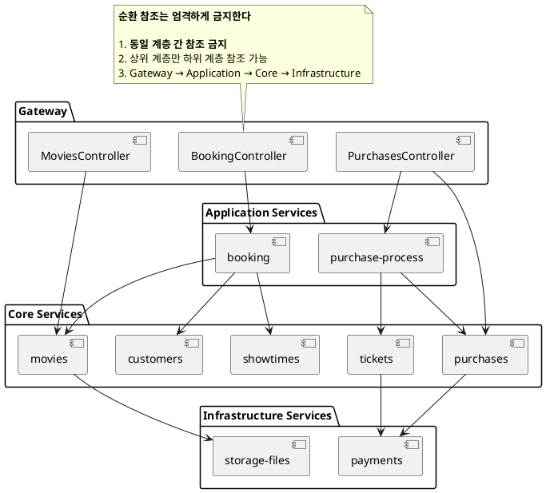
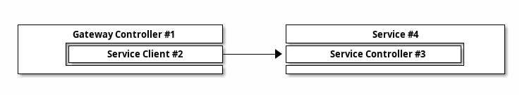

# Design Guide

설계 단계의 규칙을 설명한다.



## 1. 순환 참조 금지

### 1.1. 단방향 의존 관계

모든 서비스(모듈/클래스)는 **단방향 의존 관계**를 갖도록 설계하여 순환 참조(Circular Dependency) 문제가 발생하지 않도록 한다.
만약 서로 참조해야 할 상황이라면, 해당 부분을 **별도의 서비스**로 떼어 내거나 두 서비스를 **하나로 합치는** 방식을 고려한다.

또한, 같은 계층의 서비스들은 단방향 참조라 할지라도 허용하지 않는다. 구조가 복잡해지면서 결국 순환 참조가 되기 쉽다.

[이 프로젝트는 이런 지침을 반영해서 `index.ts`를 작성했다](./implementation.guide.md#5-import).

### 1.2. Controller의 분리

이 프로젝트의 아키텍쳐는 순환 참조 문제를 피하기 위해서 일반적인 Nest 프로젝트와 다소 다른 부분이 있다.

Nest에서는 일반적으로 Controller, Service, Repository가 같은 모듈에 위치하는 `Feature Module` 구조를 사용한다. 그런데 이 중에서 Controller는 다른 서비스를 참조하는 경우가 많아서 [순환 참조 문제](./problems-with-feature-modules.md)가 쉽게 일어난다.

따라서 이 문제를 해결하기 위해서 전통적인 모놀리식 구조에서도 Controller를 Controllers 폴더에 두어서 Service에서 완전히 분리하는 구조를 선택했다.

만약 모놀리식에서 MSA로 전환한다면 Controllers 폴더는 그대로 Gateway 모듈이 되기 때문에 확장성 측면에서도 장점이 있다.

## 2. 서비스 구조

### 2.1. 서비스의 분리

이 프로젝트의 서비스는 크게 Application, Core, Infrastructure로 나눈다

- **Application Service**:

    - 사용자 시나리오 조립 (예: 주문 → 결제 → 알림)
    - Core/Infra 서비스 호출만 허용
    - 트랜잭션 관리 주체

- **Core Service**:

    - 도메인 기본 로직 (예: 영화 관리, 극장 관리)
    - Infra 서비스 호출만 허용

- **Infrastructure Service**:

    - 외부 시스템 연동 (DB, 결제, 스토리지)

### 2.2. 서비스의 호출

REST API를 호출하면 아래 그림처럼 4단계를 거쳐서 서비스를 실행하게 된다.

> 마이크로서비스로 구성되어 있기 때문에 서비스를 호출하는 과정은 다소 복잡하다.



```
apps
├── gateway
│   └── controllers
│       └── movies.controller.ts #1
│
└── cores
    └── services
        └── movies
            ├── movies.client.ts #2
            ├── movies.controller.ts #3
            └── movies.service.ts #4
```

### 2.3. 서비스의 이름

프로세스 중심 서비스는 단수형으로 명명합니다.

1. BookingService: 티켓 예약 프로세스를 처리합니다.
1. PurchaseProcessService: 구매 프로세스를 처리합니다.
1. RecommendationService: 컨텐츠를 추천합니다.

엔티티 관리 서비스는 복수형으로 명명합니다.

1. MoviesService: 영화 엔티티를 관리합니다.
1. TheatersService: 극장 엔티티를 관리합니다.
1. TicketsService: 티켓 엔티티를 관리합니다.

## 2. REST API

### 2.1. GET과 POST 선택

10,000명의 user정보 조회 요청은 너무 길어서 GET 메서드로 전달할 수 없다.

```sh
GET /users?user-id=userid1, userid2, userid3 ...
```

이렇게 `GET`이나 `DELETE` 메서드인데 쿼리가 너무 길다면 아래처럼 POST로 요청한다.

```sh
# 찾는다
GET /movies?...
# 찾기를 실행한다
POST /movies/find

# 삭제를 한다
DELETE /movies?...
# 삭제를 실행한다
POST /movies/delete
```

POST 메서드는 일반적으로 `Create`를 의미하지만 `함수를 실행한다`는 의미로도 사용한다.

GET과 POST를 선택할 때는 다음의 사항을 고려해야 한다.

- GET이 적합한 경우
    - 전달할 데이터가 매우 적고 간단한 경우
    - 캐싱이 필요한 경우
    - 북마크 가능성이나 주소창을 통한 URL 공유가 필요한 경우
- POST가 적합한 경우
    - 전달할 데이터가 많거나 복잡한 경우 (예: 파일, 긴 텍스트 등)
    - 데이터가 민감한 경우 (예: 패스워드, 개인 정보 등)
    - 서버의 상태를 변경하는 동작을 수행하는 경우 (예: 리소스 생성, 수정)

### 2.2. Self Descriptive API 제한

HATEOAS(Hypermedia as the engine of application state)의 완전한 자체 설명을 구현하는 것은 어렵고 복잡하다.
단순 link 정도의 수준으로 제공해야 하며 복잡한 API는 문서로 설명해야 한다.

문서를 완전히 대체하려는 노력보다는 오류 정보를 더 자세히 출력하는 코드를 작성하는 것이 효율적이다.

```json
// 일반적인 HATEOAS의 예
{
    "results": [
        {
            "_expandable": {
                "children": "/rest/api/content/98308/child",
                "history": "/rest/api/content/98308/history"
            },
            "_links": {
                "self": "http://localhost:8080/confluence/rest/api/content/98308",
                "webui": "/pages/viewpage.action?pageId=98308"
            }
        }
    ]
}
```

## 3. Microservice

마이크로서비스는 아래 원칙을 기반으로 설계했다.

1. 메시지 브로커는 전달을 보장하지 않는다. 전달이 실패하는 경우를 대비해야 한다.

메시지 유실 시 처리 방안은 다음과 같은 것이 있다.

1. Idempotent Consumer: 중복 요청 방지를 위한 고유 ID 사용.
1. Dead Letter Queue (DLQ): 실패 메시지 재처리 시스템.
1. Saga 패턴: 분산 트랜잭션 관리 (Compensating Transaction 예시 추가).

## 4. Error Message

### 4.1. 기본 원칙

- **언어 중립적인 code**를 반드시 포함한다.
    - 예: ERR_FILE_UPLOAD_MAX_COUNT_EXCEEDED
    - 다국어 지원은 클라이언트 책임이므로, 서버는 사용자 언어 정보를 구체적으로 신경 쓸 필요가 없다.
- message는 참고용으로 간단히 기술한다. (클라이언트 측에서 내부적으로 번역하거나 변경 가능)
- HTTP Status가 4xx 범위일 때만 code를 포함한다.
    - 5xx 에러는 서버 장애이므로 클라이언트에 오류 원인을 상세히 노출하지 않는다.

### 4.2. 오류 코드 정의 위치

- 오류가 발생하는 코드(모듈/클래스/함수)와 가장 가까운 곳에 정의한다.
    - 예: MulterConfigServiceErrors, MulterExceptionFilterErrors 등이 해당 모듈 내부에 정의되는 형태
- 이렇게 분산된 오류 코드들을 한곳에 통합하는 객체(예: GatewayErrors)로 만든다.
    - 통합한 객체는 테스트에서 직접 사용한다.
    - 통합한 객체는 프론트엔드에 오류 코드 목록을 전달하기 용이하다.

예시:

```ts
export const MulterConfigServiceErrors = {
    InvalidFileType: {
        code: 'ERR_FILE_UPLOAD_INVALID_FILE_TYPE',
        message: 'File type not allowed.'
    }
}

export const MulterExceptionFilterErrors = {
    MaxCountExceeded: {
        code: 'ERR_FILE_UPLOAD_MAX_COUNT_EXCEEDED',
        message: 'Too many files'
    },
    MaxSizeExceeded: {
        code: 'ERR_FILE_UPLOAD_MAX_SIZE_EXCEEDED',
        message: 'File too large'
    }
}

export const GatewayErrors = {
    FileUpload: {
        ...MulterExceptionFilterErrors,
        ...MulterConfigServiceErrors
    }
}
```

### 4.3. 통합 정의 방식과 타협점

- 통합 정의 (중앙 집중식)
    - 모든 오류 메시지를 한 파일(gateway-errors.ts 등)에 모아서 관리한다.
    - 분산 서비스가 많아질수록 이 방법이 불편해질 수 있음.
- 분산 정의 후 통합 참조 (혼합 방식)
    - 각 모듈 내에서 오류 코드를 정의하고, 최종적으로 GatewayErrors 등에 합치는 방식.
    - 모듈별로 독립된 구조를 유지하면서도, 클라이언트가 일관된 인터페이스로 오류 코드를 확인할 수 있다.

## 5. API

### 5.1 전달인자로 id만 받아들이는 API

단순히 id만 전달하면 되는 조회/삭제 API는 기본적으로 복수 개를 처리하도록 설계한다.

만약 처음에 단일 객체를 처리하도록 설계하면 향후 복수의 객체를 처리하는 기능이 요구될 때 API를 추가해야 한다.
아니면 단일 객체 조회 API를 변경하고 기존에 사용하던 코드를 모두 변경해야 하는데 좋은 방법은 아니다.

### 5.2 전달인자로 다양한 값을 받아들이는 API

요청 처리에 다양한 값을 요구하는 생성/업데이트는 단일 객체를 처리하도록 설계한다.

이런 API들은 복수 객체를 처리하는 인터페이스와 단일 객체를 처리하는 인터페이스와 형태가 상당히 다르기 때문에 상황에 맞게 선택해야 한다.

```ts
// 권장하는 형태
getTheaters(theaterIds: string[]) {
}

deleteTheaters(theaterIds: string[]) {
}

// 권장하지 않음
getTheater(theaterId: string) {
}

deleteTheater(theaterId: string) {
}
```

다만, REST API는 단일 객체를 요청하는 경우가 많기 때문에 아래와 같이 단수로 받아서 복수로 요청한다.

```ts
@Get(':theaterId')
async getTheater(@Param('theaterId') theaterId: string) {
    return this.theatersService.getTheaters([theaterId])
}

@Delete(':theaterId')
async deleteTheater(@Param('theaterId') theaterId: string) {
    return this.theatersService.deleteTheaters([theaterId])
}
```

## 6. Message Broker

### 6.1 Nats를 선택한 이유

Nest가 지원하는 몇 개의 메시지 브로커 중에서 Nats를 선택했다.

- Nats는 현재까지 개발과 지원이 활발하게 이루어지고 있다.
- Nats의 JetStream을 사용하면 로깅 시스템 구축 시 Kafka를 대체할 가능성이 있다.
- 성능 확장이 쉽다
- 가벼워서 운영 뿐만 아니라 개발 환경을 구성하기 쉽다.

### 6.2. Kafka 배제 이유

message broker로 kafka를 고려했으나 다음의 이유로 선택하지 않았다.

1. kafkajs는 심각한 성능 문제가 있다. 특히 maxWaitTimeInMs를 설정하는 부분이 문제다.
   kafkajs는 무한 loop를 돌면서 메시지가 존재하는지 체크하고 없으면 maxWaitTimeInMs 만큼 sleep 한다. 그래서 jest로 테스트를 실행하고 종료할 때 maxWaitTimeInMs 만큼 대기를 해야 한다.
   즉, 간단한 테스트라고 해도 최소한 maxWaitTimeInMs 만큼의 시간이 소요된다. 무한 loop 자체로도 성능에 좋은 구조는 아니다. 무엇보다 kafkajs는 유지보수가 2022년에 종료된 것으로 보인다.

2. 테스트를 위해서 kafka 컨테이너를 초기화 할 때 topic을 생성해야 한다. topic은 controller에서 정의하는 메서드의 2배 만큼 생성하게 된다. 예를 들어 Customer 서비스에서 getCustomer 메시지를 정의했다면, topic은 getCustomer, getCustomer.reply 두 개를 생성해야 한다. 문제는 topic 1개를 생성하는 시간이 초 단위로 소요된다. 140개의 topic을 생성하는데 3분 정도 기다려야 한다.

3. kafka 컨테이너는 메모리를 많이 사용한다. kafka는 broker*3, controller*3이 최소 구성요소인데 각 컨테이너가 1기가 정도 사용한다. 이 정도 메모리 사용량은 운영에 문제는 없겠지만 로컬 개발 환경을 구성하는 데는 부담이다.

테스트에 사용한 kafka의 topic을 생성하는 스크립트를 남긴다.

```bash
#!/bin/bash
set -e
. "$(dirname "$0")/common.cfg"

kafka_topics() {
    # $@ 대신 $*를 사용한 이유는 $@는 각 인자를 따로따로 인식하기 때문이다.
    # $*는 --if-not-exists --topic getMessage 등을 그냥 공백으로 이어붙여준다.
    docker exec $KAFKA_BROKER1 sh -c "./kafka-topics.sh --bootstrap-server ${KAFKA_BROKER_LIST} $*"
}

while IFS= read -r MESSAGE; do
    # 빈 줄이거나 '#'로 시작하는 경우 건너뛰기
    if [ -z "$MESSAGE" ] || [[ "$MESSAGE" == \#* ]]; then
        continue
    fi

    kafka_topics --create --if-not-exists --topic "${MESSAGE}"
    kafka_topics --create --if-not-exists --topic "${MESSAGE}.reply"
done <messages.txt

kafka_topics --list
```

### 6.3. 그 외 메시지 브로커들

그 외 다른 메시지 브로커는 아래의 이유로 선택하지 않았다.

- MQTT는 IoT 장치와 같이 리소스가 제한된 환경에 최적화되어 있어, 대규모 시스템에서는 성능이 부족할 수 있습니다.
- RabbitMQ는 설정과 관리가 복잡하며, 특히 클러스터링이나 고가용성(HA)을 구현하는 데 어려움이 있을 수 있습니다.
