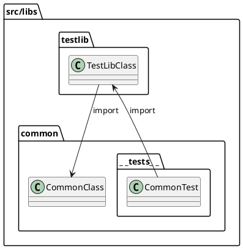

# Implementation Guide

구현 단계의 규칙을 설명한다.

## 1. Naming Rules

### 1.1. find vs get

함수명이 find...인 경우와 get...인 경우가 있는데 요청한 리소스가 없을 때 처리 방법이 다르다.

```ts
/**
 * 만약 해당 Seed가 없다면 null을 반환한다.
*/
findSeed(seedId: string)

/**
 * 만약 해당 Seed가 없다면 예외를 던진다.
*/
getSeed(seedId: string)
```

찾는 것이 없을 수도 있기 때문에 find는 null을 반환한다. 그러나 존재하지 않는 것을 가지려고 한다면 오류이기 때문에 get은 예외를 발생시킨다.

### 1.2. FilterDto vs QueryDto

PaginationOption을 상속한 경우 이름에 QueryDto를 사용하세요.

- 페이징이 포함된 조회 요청은 단순 필터링보다 더 일반적인 데이터 조회와 관련되므로 “Query”가 적합합니다.

PaginationOption을 상속하지 않은 경우 이름에 FilterDto를 사용하세요.

- 페이징 없이 특정 조건만을 사용한 필터링 요청이라는 점을 명확히 전달합니다.

### 1.2. 함수명에 전달인자 언급 피하기

전달인자를 함수명에 반영하면 유연성이 떨어지고 읽기 어렵다.

```ts
// 함수명에 전달인자 정보를 넣는 것은 피한다.
findTheatersForMovie(movieId)

// 대신 아래와 같이 object로 받는다.
findTheaters({ movieId })
```

### 1.3. 테스트 설명 형식

When [Condition], expect [Error Type]

1. 실패 케이스\
   "should return [Error Type] when [Condition]"\
   "should return NOT_FOUND(404) when movieId is not found"

2. 성공 케이스\
   "should [Action] and return [Error Type]"\
   "should create a new resource and return CREATED(201)"

## 2. TypeORM과 도메인의 Entity 관계

다음은 일반적인 Entity를 구현한 코드다.

```ts
@Entity()
export class Seed extends TypeormEntity {
    @Column()
    name: string

    @Column({ type: 'text' })
    desc: string

    @Column({ type: 'integer' })
    integer: number

    @Column('varchar', { array: true })
    enums: SeedEnum[]

    @Column({ type: 'timestamptz' })
    date: Date
}
```

Entity 코드와 Infrastructure 레이어에 위치하는 TypeORM의 코드가 섞여 있다. 두 레이어의 코드가 섞여 있지만 Entity 코드는 Infrastructure 코드를 참조하지 않는다.

마찬가지로 TypeORM의 @Column 데코레이터는 데이터 매핑을 위한 것이고, 이 코드가 도메인 객체 내에 있어도 도메인 로직에 영향을 미치지 않는다.

결과적으로, 도메인 객체에 TypeORM 코드가 추가된 것은 엔티티와 ORM 사이의 편리한 연결을 위한 것이다. 이것은 TypeORM이 도메인 엔티티에 의존하게 하고, 엔티티가 TypeORM에 의존하지 않게 한다. 이 구조는 DDD의 개념과 상충하지 않으며, 두 영역 간의 깔끔한 분리를 제공한다.

## 3. 테스트 코드

### 3.1. InternalServerErrorException의 테스트 작성

InternalServerErrorException을 발생시키는 것은 일반적인 방법으로 재현하기 어렵다. 테스트 시 이익도 크지 않기 때문에 테스트를 작성하지 않는 것을 원칙으로 한다.

그 외, 일반적인 사용자 입력으로 재현이 안 되는 방어적 코드는 아래의 방법처럼 테스트 대상에서 제외한다.

```ts
if (exception instanceof HttpException) {
    error = { status: exception.getStatus(), message: exception.message }
} else {
    /* istanbul ignore next */
    error = { status: 500, message: 'Internal server error' }
}
```

혹은, 아래처럼 Assert를 사용하면 code coverage를 무시하는 태그를 작성하지 않아도 된다.

```js
/* istanbul ignore if */
if (seed === undefined) {
    throw new LogicException(`Seed(${seedId}) not found`)
}

// 간단하게 작성한다
Assert.defined(seed, `Seed(${seedId}) not found`)
```

## 4. Scope.REQUEST

아래와 같이 Scope.REQUEST로 설정된 TransactionService를 사용하면 scope bubble up 문제가 발생해서 unit 테스트가 어려워진다.

```ts
@Injectable({ scope: Scope.REQUEST })
export class TransactionService implements OnModuleDestroy {
    private queryRunner?: QueryRunner

    constructor(private dataSource: DataSource) {}

    async onModuleDestroy() {
        if (this.queryRunner && !this.queryRunner.isReleased) {
            await this.rollbackAndRelease()
        }
    }

    async startTransaction(): Promise<void> {
        if (!this.queryRunner) {
            this.queryRunner = this.dataSource.createQueryRunner()
            await this.queryRunner.connect()
        }

        try {
            await this.queryRunner.startTransaction()
        } catch (error) {
            throw new SystemException(`Failed to start a new transaction(${error})`)
        }
    }

    ...
}
```

## 5. import

```
src
├── controllers
│   ├── index.ts
│   ├── auth.controller.ts
│   └── users.controller.ts
└── services
    ├── auth
    │   ├── index.ts
    │   ├── auth.service.ts
    │   └── strategies
    └── users
        ├── index.ts
        ├── users.repository.ts
        └── users.service.ts

```

위와 같은 폴더/파일 구조가 있을 때 순환 참조를 피하기 위해서 다음의 규칙을 지켜야 한다.

- 직계 조상 폴더는 절대 경로를 사용하면 안 된다.
    ```ts
    /* users.service.ts에서 */
    // 순환 참조 발생
    import { AuthService } from 'src/services'
    // 정상
    import { AuthService } from '../auth'
    ```
- 직계 조상이 아니면 절대 경로를 사용해야 한다.
    ```ts
    /* users.controller.ts에서 */
    // 정상
    import { AuthService } from 'src/services'
    // 권장하지 않음
    import { AuthService } from '../services'
    ```

## 6. testlib와 common의 순환 참조

src/libs에 testlib와 common가 있다. 이 두 라이브러리는 순환 참조 하는 것처럼 보인다.

기본적으로 `testlib`가 `common`를 참조한다. 그리고 `common`도 `testlib`를 참조하는 것처럼 보이는데, `common`에 `__tests__`가 존재하고 `__tests__`는 보통 `testlib`를 `import`하기 때문이다.

비록 `__tests__`가 각 모듈 마다 존재하지만 `__tests__`는 다른 모듈에서 참조하는 코드가 아니기 때문에 순환 참조 문제가 발생하지 않는다.



## 8. 테스트에서 dynamic import

- 배경
  테스트에서 Nats 서버를 공유하기 떄문에 유니크한 subject를 생성하기 위해서 process.env.TEST_ID를 사용함.
- 문제
  Jest의 module cache 기능 때문에 @MessagePattern 데코레이터는 모듈 로딩 시에 한 번만 평가된다.
  따라서 최상위에서 이미 import된 모듈의 경우 각 테스트마다 다른 process.env.TEST_ID 값을 반영하지 못합니다.
- 해결 방법
  resetModules: true로 설정해서 각 테스트 마다 module cache를 초기화합니다.
  아래 테스트는 문제 검증과 해결 방법을 보여줍니다.

1. Fixture 타입 정보를 사용하고 싶다면 타입 전용 import를 활용하면 됩니다. 타입 전용 import는 런타임 코드에 영향을 주지 않고, 컴파일 타임에만 타입 체크를 위한 용도로 사용됩니다.

```ts
import type { Fixture } from './create-test-context.fixture'
```

## 10. entry file

각 프로젝트의 루트에는 아래의 파일들을 포함한다.

- development.ts
- main.ts
- production.ts

일반적으로 `main.ts`가 entry file이 되지만 여기서는 `development.ts`나 `production.ts`가 entry file이 된다.
이렇게 한 이유는 main.ts에서 process.env.NODE_ENV의 상태에 따라서 분기하는 코드를 피하기 위해서다. if는 복잡성을 증가시키기 때문에 이 프로젝트에서는 사용을 최소화 했다.

이와 관련된 사항은 아래 세 개의 파일에 정의되어 있다.

```json
// package.json
"scripts": {
    "build": "nest build ${TARGET_APP} -b webpack",
    "debug": "nest start ${TARGET_APP} --watch",
}
```

```json
// nest-cli.json
"projects": {
    "gateway": {
        "type": "application",
        "entryFile": "apps/gateway/development",
        "sourceRoot": "src"
    }
}
```

```json
// webpack.config.js
    const output = {
        ...options,
        entry: path.resolve(dirname, 'production.ts'),
    }
```
