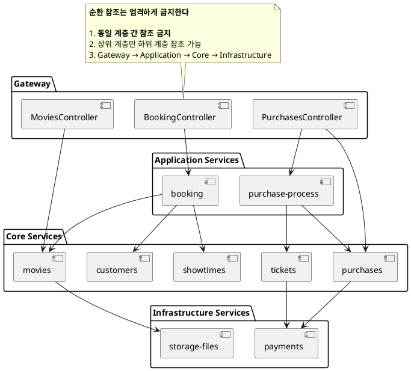
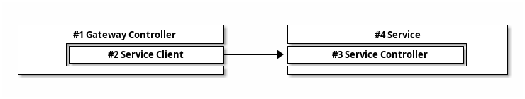

# Design Guide

설계 과정에서 적용한 규칙을 정리했습니다.



## 1. 순환 참조 금지

### 1.1. 단방향 의존 관계

모든 서비스(모듈/클래스)는 **단방향 의존 관계**를 갖도록 설계하여 순환 참조(Circular Dependency) 문제가 발생하지 않도록 합니다.

이는 하위 계층의 서비스만 참조할 수 있다는 의미이며, 같은 계층의 서비스 간에는 어떠한 형태의 참조도 허용하지 않습니다.

이렇게 함으로써 구조가 복잡해질수록 발생하기 쉬운 순환 참조 문제를 예방합니다.

[이 프로젝트는 이런 지침을 반영해서 `index.ts`를 작성했습니다.](./implementation.guide.md#5-import)

### 1.2. Controller의 분리

> 모놀리식 구조인 [nest-mono](https://github.com/mannercode/nest-mono) 프로젝트에 해당하는 설명입니다.

`nest-mono` 프로젝트는 순환 참조 문제를 방지하기 위해, 일반적인 Nest(NestJS) 구조와는 다른 아키텍처 방식을 채택합니다.

Nest에서는 보통 `Controller`, `Service`, `Repository`를 하나의 모듈로 묶는 `Feature Module` 방식을 사용합니다.
그러나 이 방식은 `Controller`가 여러 서비스를 참조하는 경우가 많아, [순환 참조 문제](./problems-with-feature-modules.md)가 쉽게 발생할 수 있습니다.

이를 방지하기 위해 `nest-mono`에서는 전통적인 모놀리식 구조 내에서도 `Controller`를 `Controllers` 폴더에 분리하여 `Service`와 명확히 구분합니다.

이러한 구조는 서비스 간 결합도를 낮추고, **모놀리식에서 MSA로 전환할 때 `Controllers` 폴더를 그대로 `Gateway` 모듈로 전환할 수 있는 확장성**을 제공합니다.

## 2. 서비스 구조

### 2.1. 서비스의 분리

이 프로젝트의 서비스는 크게 `Application`, `Core`, `Infrastructure`로 구분합니다.

- **Application Service**:
    - 사용자 시나리오를 조립합니다 (예: 주문 → 결제 → 알림).
    - Core/Infra 서비스 호출만 허용합니다.
    - 트랜잭션 관리를 주도합니다.
- **Core Service**:
    - 도메인의 기본 로직을 담당합니다 (예: 영화 관리, 극장 관리).
    - Infra 서비스 호출만 허용합니다.
- **Infrastructure Service**:
    - DB, 결제, 스토리지 등 외부 시스템 연동을 담당합니다.

### 2.2. 서비스의 호출

> 마이크로서비스 구조인 [nest-msa](https://github.com/mannercode/nest-msa) 프로젝트에 해당하는 설명입니다.

REST API를 호출하면, 아래 그림처럼 4단계를 거쳐서 서비스를 실행합니다.



```
apps
├── gateway
│   └── controllers
│       └── #1 movies.controller.ts
│
└── cores
    └── services
        └── movies
            ├── #2 movies.client.ts
            ├── #3 movies.controller.ts
            └── #4 movies.service.ts
```

### 2.3. 서비스의 이름

프로세스 중심 서비스는 단수형으로 명명합니다.

1. BookingService: 티켓 예약 프로세스를 처리합니다.
1. PurchaseProcessService: 구매 프로세스를 처리합니다.
1. RecommendationService: 컨텐츠를 추천합니다.

엔티티 관리 서비스는 복수형으로 명명합니다.

1. MoviesService: 영화 엔티티를 관리합니다.
1. TheatersService: 극장 엔티티를 관리합니다.
1. TicketsService: 티켓 엔티티를 관리합니다.

## 3. REST API

### 3.1. GET과 POST 선택

10,000명의 사용자 정보를 한 번에 조회하는 요청은 너무 길어서 GET 메서드로 전달하기 어렵습니다.

```sh
GET /users?user-id=userid1, userid2, userid3 ...
```

이처럼 `GET`이나 `DELETE` 메서드인데 쿼리가 너무 길다면, 아래 예시처럼 `POST`로 요청합니다.

```sh
# 찾는다
GET /movies?...
# 찾기를 실행한다
POST /movies/find

# 삭제를 한다
DELETE /movies?...
# 삭제를 실행한다
POST /movies/delete
```

POST 메서드는 일반적으로 `Create`를 의미하지만 `함수를 실행한다`는 의미로도 사용한다.
POST 메서드는 보통 `Create`를 의미하지만, 경우에 따라 **함수를 실행**한다는 의미로도 사용합니다.

GET과 POST를 선택할 때는 다음 사항을 고려합니다.

- GET이 적합한 경우
    - 전달할 데이터가 매우 적고 간단한 경우
    - 캐싱이 필요한 경우
    - 북마크 가능성이나 주소창을 통한 URL 공유가 필요한 경우
- POST가 적합한 경우
    - 전달할 데이터가 많거나 복잡한 경우 (예: 파일, 긴 텍스트 등)
    - 데이터가 민감한 경우 (예: 패스워드, 개인 정보 등)
    - 서버의 상태를 변경하는 동작을 수행하는 경우 (예: 리소스 생성, 수정)

### 3.2. Self-Descriptive API 제한 사항

HATEOAS(Hypermedia as the engine of application state)의 완전한 자체 설명을 구현하는 것은 어렵고 복잡합니다.
단순 link 정도의 수준만 제공하고, 복잡한 API는 문서로 설명하는 편이 효율적입니다.

문서를 완전히 대체하려고 애쓰기보다는, 오류 정보를 더 자세히 출력하는 코드를 작성하는 것이 생산적입니다.

```json
// 일반적인 HATEOAS의 예
{
    "results": [
        {
            "_expandable": {
                "children": "/rest/api/content/98308/child",
                "history": "/rest/api/content/98308/history"
            },
            "_links": {
                "self": "http://localhost:8080/confluence/rest/api/content/98308",
                "webui": "/pages/viewpage.action?pageId=98308"
            }
        }
    ]
}
```

## 4. Error Message

### 4.1. 기본 원칙

- **언어 중립적인 code**를 반드시 포함합니다.
    - 예: ERR_FILE_UPLOAD_MAX_COUNT_EXCEEDED
    - 다국어 지원은 클라이언트 책임이므로, 서버는 사용자 언어 정보를 구체적으로 신경 쓸 필요가 없습니다.
- message는 참고용으로 간단히 기술합니다. (클라이언트 측에서 내부적으로 번역하거나 변경할 수 있습니다)
- HTTP Status가 4xx 범위일 때만 code를 포함합니다.
    - 5xx 에러는 서버 장애이므로 클라이언트에 오류 원인을 상세히 노출하지 않습니다.

### 4.2. 오류 코드 정의 위치

- 오류가 발생하는 코드(모듈/클래스/함수)와 가장 가까운 곳에서 정의합니다.
    - 예: MulterConfigServiceErrors, MulterExceptionFilterErrors 등은 해당 모듈 내부에 정의합니다.
- 이렇게 분산된 오류 코드를 한곳에 통합하는 객체(예: GatewayErrors)로 만들 수 있습니다.
    - 통합 객체는 테스트에서 직접 사용합니다.
    - 프론트엔드에 오류 코드 목록을 전달할 때도 유용합니다.

예시:

```ts
export const MulterConfigServiceErrors = {
    InvalidFileType: {
        code: 'ERR_FILE_UPLOAD_INVALID_FILE_TYPE',
        message: 'File type not allowed.'
    }
}

export const MulterExceptionFilterErrors = {
    MaxCountExceeded: {
        code: 'ERR_FILE_UPLOAD_MAX_COUNT_EXCEEDED',
        message: 'Too many files'
    },
    MaxSizeExceeded: {
        code: 'ERR_FILE_UPLOAD_MAX_SIZE_EXCEEDED',
        message: 'File too large'
    }
}

export const GatewayErrors = {
    FileUpload: {
        ...MulterExceptionFilterErrors,
        ...MulterConfigServiceErrors
    }
}
```

### 4.3. 통합 정의 방식과 타협점

- 통합 정의 (중앙 집중식)
    - 모든 오류 메시지를 한 파일(gateway-errors.ts 등)에 모아서 관리합니다.
    - 분산된 서비스가 많아지면 이 방법이 불편해질 수 있습니다.
- 분산 정의 후 통합 참조 (혼합 방식)
    - 각 모듈 내에서 오류 코드를 정의하고, 최종적으로 GatewayErrors 등에 합치는 방식입니다.
    - 모듈별 독립성을 유지하면서도, 클라이언트가 오류 코드를 일관된 인터페이스로 확인할 수 있다는 장점이 있습니다.

## 5. API

### 5.1 전달인자로 id만 받아들이는 API

id만 전달하면 되는 간단한 조회·삭제 API는 기본적으로 **복수 개**를 처리하도록 설계합니다.

만약 처음부터 단일 객체만 처리하도록 설계했다가, 나중에 복수 객체를 처리할 필요가 생기면 API를 새로 추가하거나 기존 API를 변경해야 하므로 불편합니다. 따라서 처음부터 복수형 id 배열을 받도록 설계하는 편이 확장성에 유리합니다.

### 5.2 전달인자로 다양한 값을 받아들이는 API

생성·업데이트처럼 요청 처리에 다양한 값을 요구하는 경우에는 **단일 객체**를 처리하도록 설계합니다.

이런 API들은 복수 객체를 처리하는 형태와 단일 객체를 처리하는 형태가 상당히 다르므로, 상황에 맞게 나누어 사용하는 것이 좋습니다.

```ts
// 권장하는 형태
getTheaters(theaterIds: string[]) {}
deleteTheaters(theaterIds: string[]) {}

// 권장하지 않음
getTheater(theaterId: string) {}
deleteTheater(theaterId: string) {}
```

다만, REST API는 단일 객체를 요청하는 경우가 많습니다. 따라서 아래와 같이 단수 인자를 받아서 내부적으로 복수 인자를 사용하는 식으로 구현합니다.

```ts
@Get(':theaterId')
async getTheater(@Param('theaterId') theaterId: string) {
    return this.theatersService.getTheaters([theaterId])
}

@Delete(':theaterId')
async deleteTheater(@Param('theaterId') theaterId: string) {
    return this.theatersService.deleteTheaters([theaterId])
}
```

## 6. Message Broker

> 마이크로서비스 구조인 [nest-msa](https://github.com/mannercode/nest-msa) 프로젝트에 해당하는 설명입니다.

### 6.1 NATS를 선택한 이유

Nest(NestJS)가 지원하는 메시지 브로커 중 몇 가지를 검토한 결과, NATS를 선택했습니다.

- NATS는 현재까지 활발하게 개발·지원되고 있습니다.
- NATS의 JetStream을 사용하면 로깅 시스템 구축 시 Kafka를 대체할 가능성이 있습니다.
- 성능 확장이 쉽습니다.
- 가벼워서 운영뿐만 아니라 개발 환경을 구성하기에도 용이합니다.

### 6.2. Kafka 배제 이유

메시지 브로커로 Kafka도 고려했으나, 다음과 같은 이유로 사용하지 않았습니다.

- **kafkajs의 성능 문제**

    maxWaitTimeInMs를 설정하는 부분에서 심각한 문제가 발생합니다.
    kafkajs는 무한 루프를 돌면서 메시지가 있는지 계속 확인하고, 메시지가 없으면 maxWaitTimeInMs만큼 sleep합니다. 그래서 Jest로 테스트를 실행하고 종료할 때 maxWaitTimeInMs만큼 대기해야 합니다.
    즉, 간단한 테스트라도 최소한 maxWaitTimeInMs만큼 시간이 소요됩니다. 무한 루프 구조 자체도 성능에 불리합니다. 무엇보다 kafkajs는 2022년에 유지보수가 종료된 것으로 보입니다.

- **테스트 시 토픽 생성 문제**

    테스트를 위해 Kafka 컨테이너를 초기화할 때, 토픽(topic)을 미리 생성해야 합니다. 예를 들어 Customer 서비스에서 getCustomer 메시지를 정의하면, getCustomer와 getCustomer.reply 두 개의 토픽이 필요합니다. 토픽 하나를 생성하는 데 수 초가 걸리므로, 토픽이 많아질수록 대기 시간이 크게 늘어납니다. nest-msa에서는 전체 테스트 실행 시 인프라를 초기화하므로, 이 문제가 특히 커집니다.

- **높은 메모리 사용량**

    Kafka는 최소 broker3, controller3 구성이 필요한데, 각 컨테이너가 1GB 정도를 사용합니다. 운영 환경에서는 큰 문제가 되지 않더라도, 로컬 개발 환경에서는 부담이 됩니다.

### 6.3. 그 외 메시지 브로커들

아래 브로커들도 검토했지만, 다음 이유로 선택하지 않았습니다.

- MQTT: IoT 장치처럼 리소스가 제한된 환경에는 최적화되어 있지만, 대규모 시스템에서는 성능이 부족할 수 있습니다.
- RabbitMQ: 설정과 관리가 복잡하며, 특히 클러스터링이나 고가용성(HA)을 구현하기가 까다롭습니다.
