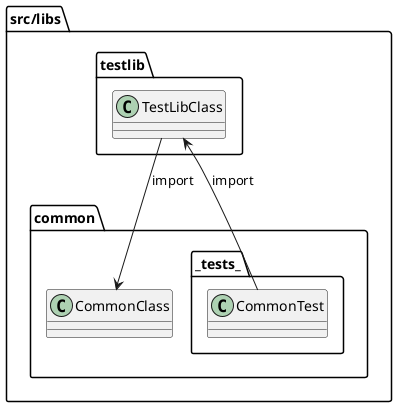

# Implementation Guide

구현 단계에서 지켜야 할 규칙을 정리합니다.

## 1. Naming Rules

### 1.1. find vs get

함수명이 find...인 경우와 get...인 경우에는, 요청한 리소스가 없을 때 처리 방식이 다릅니다.

```ts
// 해당 Seed가 없으면 null을 반환합니다.
findSeed(seedId: string)

// 해당 Seed가 없으면 예외를 던집니다.
getSeed(seedId: string)
```

find는 **찾는 대상이 없을 수도 있다**는 의미이므로 `null`을 반환합니다.

그러나 get은 **반드시 존재해야 하는 대상을 가져온다**는 의미이므로, 해당 리소스가 없으면 예외를 던지는 것이 적절합니다.

### 1.2. 함수명에 전달인자 언급 피하기

전달인자를 함수명에 반영하면 함수가 유연성을 잃고, 읽기도 어렵습니다.

```ts
// 함수명에 전달인자 정보를 직접 쓰는 것은 피합니다.
findTheatersForMovie(movieId)

// 대신 아래처럼 객체 형태로 받습니다.
findTheaters({ movieId })
```

## 2. TypeORM과 도메인의 Entity 관계

다음은 일반적인 엔티티를 구현한 예시 코드입니다.

```ts
@Entity()
export class Seed extends TypeormEntity {
    @Column()
    name: string

    @Column({ type: 'text' })
    desc: string

    @Column({ type: 'integer' })
    integer: number

    @Column('varchar', { array: true })
    enums: SeedEnum[]

    @Column({ type: 'timestamptz' })
    date: Date
}
```

`Entity` 코드와 `Infrastructure` 레이어에 위치하는 `TypeORM` 코드가 섞여 있지만, 엔티티 자체는 `Infrastructure` 코드를 직접 참조하지 않습니다.
또한, `TypeORM`의 `@Column` 데코레이터는 데이터 매핑을 위한 코드이며, 도메인 로직에 직접적인 영향을 주지 않습니다.

결과적으로, 도메인 객체에 `TypeORM` 코드가 일부 추가된 것은 양쪽을 편리하게 연결하기 위한 방식입니다. `TypeORM`은 엔티티에 의존하지만, 엔티티가 `TypeORM`에 의존하지 않도록 하여, `DDD` 관점에서도 크게 문제되지 않는 구조를 유지합니다.

## 3. import

아래와 같은 폴더/파일 구조를 가정합니다.

```
src
├── controllers
│   ├── index.ts
│   ├── auth.controller.ts
│   └── users.controller.ts
└── services
    ├── auth
    │   ├── index.ts
    │   ├── auth.service.ts
    │   └── strategies
    └── users
        ├── index.ts
        ├── users.repository.ts
        └── users.service.ts

```

이때 순환 참조를 피하기 위해 다음 규칙을 지킵니다.

- 직계 조상 폴더는 절대 경로로 import하지 않습니다.

    ```ts
    /* users.service.ts */

    // (X) 순환 참조 발생 가능
    import { AuthService } from 'src/services'

    // (O) 상대 경로로 참조
    import { AuthService } from '../auth'
    ```

- 직계 조상이 아닌 폴더는 절대 경로를 사용합니다.

    ```ts
    /* users.controller.ts */

    // (O) 절대 경로 사용
    import { AuthService } from 'src/services'

    // (X) 상대 경로로는 권장하지 않음
    import { AuthService } from '../services'
    ```

> index.ts에서 여러 모듈을 하나로 묶어서 export해주는 방식을 Barrel import라고 합니다.\
> 이 프로젝트는 index.ts를 폴더 마다 두고 있는데, 이렇게 하면 순환 참조를 더 빨리 발견할 수 있습니다.

## 4. testlib와 common의 순환 참조

`src/libs` 폴더에는 `testlib`와 `common`이 있습니다. 언뜻 보면 서로를 참조하는 순환 구조처럼 보일 수 있습니다.

- 기본적으로 `testlib`는 `common`을 `import`합니다.
- `common`에도 **tests** 폴더가 있는데, 여기서 `testlib`를 `import`하는 코드가 들어 있을 수 있습니다.

그러나 **tests** 폴더는 해당 모듈 내부 테스트를 위한 것이며, 실제 애플리케이션 로직에서는 참조되지 않습니다. 따라서 상호 의존성이 실행 시점에 충돌을 일으키지 않으므로 실제 순환 참조 문제가 발생하지 않습니다.



## 5. 테스트에서 dynamic import

여러 테스트에서 같은 NATS 서버를 공유하기 때문에, 각 테스트마다 고유한 subject를 생성하기 위해 process.env.TEST_ID를 사용합니다.

문제는 Jest의 모듈 캐시 때문에 @MessagePattern 데코레이터가 모듈 로딩 시점에 한 번만 평가됩니다. 따라서 최상위에서 이미 import된 모듈은 새로운 process.env.TEST_ID 값을 인식하지 못합니다.

이 문제를 해결하기 위해서, Jest 설정에서 resetModules: true를 적용하여 각 테스트마다 모듈 캐시를 초기화합니다.

```ts
// 타입 전용 import를 활용하면 런타임에 영향을 주지 않고 타입만 가져올 수 있습니다.
import type { Fixture } from './customers.fixture'

describe('Customers', () => {
    let fix: Fixture

    beforeEach(async () => {
        const { createFixture } = await import('./customers.fixture')
        fix = await createFixture()
    })
})
```

## 6. entry file

각 프로젝트의 루트에는 다음 파일들이 존재합니다.

- development.ts
- main.ts
- production.ts

일반적으로는 `main.ts`가 엔트리 파일이 되지만, 이 프로젝트에서는 `development.ts`나 `production.ts`가 실제 엔트리 파일로 사용됩니다.
이는 `main.ts` 내부에서 `process.env.NODE_ENV`에 따라 여러 `조건문(if)`을 사용하는 복잡성을 피하기 위함입니다.

아래는 관련 예시 설정입니다.

```json
// package.json
"scripts": {
    "build": "nest build ${TARGET_APP} -b webpack",
    "debug": "nest start ${TARGET_APP} --watch",
}
```

```json
// nest-cli.json
"projects": {
    "gateway": {
        "type": "application",
        "entryFile": "apps/gateway/development",
        "sourceRoot": "src"
    }
}
```

```json
// webpack.config.js
    const output = {
        ...options,
        entry: path.resolve(dirname, 'production.ts'),
    }
```

## 7. 테스트 코드를 .spec.ts와 .fixture.ts로 분리

.spec.ts에 Fixture 설정 코드를 모두 넣으면, 실제 테스트 로직이 무엇을 검증하는지 파악하기가 어렵습니다. 따라서 테스트 로직은 .spec.ts에 집중하고, 테스트에 필요한 리소스나 설정은 .fixture.ts에 둡니다.

예: `src/apps/__tests__/utils` 폴더에 공통 코드가 모여 있고, 그중 `clients.ts`에서 `module.get()`으로 필요한 `Service 인스턴스`를 미리 가져옵니다. 이렇게 하면 테스트가 간결해지며, 중복 코드를 줄일 수 있습니다.

만약 새로운 서비스를 추가하고 테스트를 작성한다면, `clients.ts`와 `create-all-test-contexts.ts` 등을 변경해야 합니다.

```ts
import { CustomersClient, MoviesClient } from 'apps/cores'
import { HttpTestContext, TestContext } from 'testlib'

export class AllProviders {
    customersClient: CustomersClient
    moviesClient: MoviesClient
}

export async function getProviders(coresContext: TestContext) {
    const { module: coresModule } = coresContext
    const customersClient = coresModule.get(CustomersClient)
    const moviesClient = coresModule.get(MoviesClient)

    return { customersClient, moviesClient }
}
```
