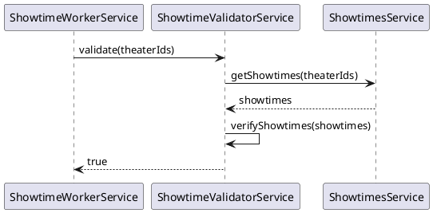
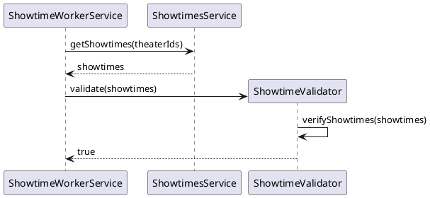

# Naming Rules

## 1. 함수명에 전달인자 언급 피하기

전달인자를 함수명에 반영하면 함수가 유연성을 잃고, 읽기도 어렵습니다.

```ts
// 함수명에 전달인자 정보를 직접 쓰는 것은 피합니다.
findTheatersForMovie(movieId)

// 대신 아래처럼 객체 형태로 받습니다.
findTheaters({ movieId })
```

## 2. 조회 함수: **find / get / search**

| 형태                 | 용도                                  | 없을 때 동작                             |
| -------------------- | ------------------------------------- | ---------------------------------------- |
| **`findXxx(...)`**   | "없을 수도 있는" 대상 **선택적 조회** | `null` 반환                              |
| **`getXxx(...)`**    | 반드시 존재해야 하는 **단건 조회**    | **예외 throw** (예: `NotFoundException`) |
| **`searchXxx(...)`** | 조건·키워드 기반 **다건 검색**        | 빈 배열 반환                             |

```ts
// 예시: Seed 리포지토리
findSeed(seedId: string): Promise<Seed | null>      // 없으면 null
getSeed(seedId: string): Promise<Seed>              // 없으면 예외 throw
searchSeeds(dto: SeedSearchDto): Promise<Seed[]>    // 조건 검색, 없으면 []
```

> find는 찾으려는 대상이 명확한 경우, search는 찾는 대상이 뭐가 될지 알 수 없는 경우

## 3. 존재 여부(Predicate) 함수: **exist / is / has / can / should**

이 프로젝트는 단일 엔티티 존재 함수는 사용하지 않는다. 따라서 아래처럼 두 개의 존재 함수만 사용한다.

| 형태                      | 동작                      |
| ------------------------- | ------------------------- |
| **`moviesExist(ids)`**    | 모든 ID가 존재해야 `true` |
| **`anyMovieExists(ids)`** | 하나라도 존재하면 `true`  |

### 그 외, 공통 접두사/패턴

- **is\*** : 상태 확인 → `isMovieReleased()`
- **has\*** : 소유 여부 → `hasMoviePoster()`
- **can\*** : 권한/가능 여부 → `canUserEditMovie()`
- **should\*** : 규칙 기반 권장 여부 → `shouldArchiveMovie()`

> **의미가 긍정형**이 되도록 네이밍한다. (`isActive`, `hasError` ❌ `isNotActive`)

## 4. 검증 함수: **verify / check / ensure**

| 형태              | 용도                                          |
| ----------------- | --------------------------------------------- |
| verifyMovieExists | “확인하고, 없으면 예외/에러”처럼              |
| checkMovieExists  | 결과를 bool 로 받지만 “검사 행위”를 살짝 강조 |
| ensureMovieExists | 없으면 생성                                   |

## 5. Service의 역할과 명명 규칙

정해진 요청을 처리하기 위해 다른 서비스를 호출해서 필요한 작업을 스스로 하면 Service라고 명명한다.

예를 들어 `ShowtimeValidatorService`는 요청을 받으면 `ShowtimesService`를 호출해서 검증한다.



그런데 만약 Showtime 검증에 필요한 데이터를 호출자에게 전달받아서 작업 후 결과를 반환하는 역할이라면 `ShowtimeValidaor`라고 명명한다.


