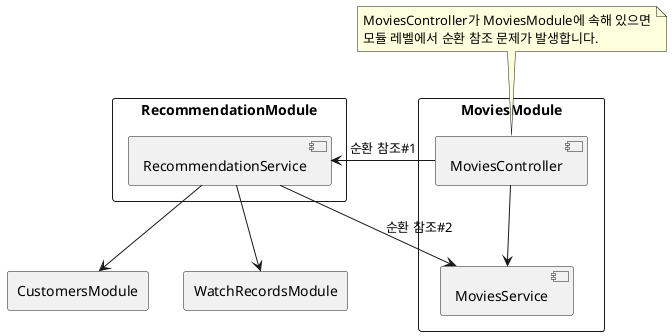
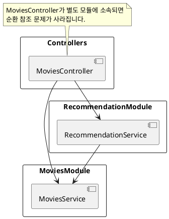

# Problems with Feature Modules

Nest에서는 Controller, Service, Repository를 하나의 모듈 안에 배치하는 구조를 `Feature Module`이라고 합니다. [Nest 공식 문서](<https://docs.nestjs.com/modules#feature-modules>)에서는 이 구조에 대해 다음과 같이 설명합니다.

> CatsController와 CatsService는 동일한 애플리케이션 도메인에 속합니다.\
> 서로 밀접하게 연관되어 있으므로 기능 모듈로 이동하는 것이 좋습니다.\
> 기능 모듈은 특정 기능과 관련된 코드를 간단히 정리하여 코드를 체계적으로 유지하고 명확한 경계를 설정합니다.\
> 이는 특히 애플리케이션 및/또는 팀의 규모가 커짐에 따라 복잡성을 관리하고 SOLID 원칙에 따라 개발하는 데 도움이 됩니다.

그러나 Feature Module 구조는 `순환 참조 문제`가 비교적 쉽게 발생할 수 있다는 단점이 있습니다.

## 1. 모듈 간 순환 참조 예시

가령 일반적인 영화 엔티티를 관리하기 위해 다음과 같은 MoviesController가 있다고 가정합니다.

```
GET /movies
GET /movies/{movieId}
```

그런데 고객에게 영화를 추천하는 REST API를 추가하려면 다음과 같은 경로가 필요합니다.

```
GET /movies/recommended
```

추천 기능을 구현하려면 관람 이력, 연령, 성별 등 다양한 고객 정보를 알아야 합니다. 이것을 MoviesService에서 처리하기 어렵다고 판단하여 별도의 RecommendationService를 만듭니다.

그러면 MoviesController는 아래처럼 두 서비스를 모두 참조하게 됩니다.

```ts
export class MoviesController {
    constructor(
        private moviesService: MoviesService,
        private recommendationService: RecommendationService
    ) {}
}
```

하지만 RecommendationService는 MoviesService, CustomersService, WatchRecordsService 등을 참조합니다.\
이 모든 서비스를 하나의 MoviesModule 안에 넣기에는 부담스러우므로, RecommendationService를 RecommendationModule으로 분리합니다.

문제는 이때 MoviesModule에 MoviesController와 MoviesService가 함께 정의되어 있으면, 모듈 단에서 순환 참조가 생길 수 있다는 점입니다. 아래 그림을 예로 들어봅시다.



RecommendationService와 MoviesService가 단방향 관계를 갖더라도, MoviesController가 같은 모듈(MoviesModule)에 묶여 있으면 모듈 차원에서 순환 참조가 발생하게 됩니다.

## 2. Controller 분리로 해결

이 문제를 해결하기 위해, MoviesController를 비롯한 모든 Controller를 ControllersModule이라는 독립된 모듈로 분리할 수 있습니다. 이렇게 하면 모듈 간 순환 참조가 상당 부분 해소됩니다.



만약 Feature Modules 방식을 고수하고 싶다면, REST API 경로를 분리해서 다음과 같은 컨트롤러를 따로 만드는 방법이 있습니다.

```ts
// GET /recommendation/movies
export class RecommendationController {}
```

## 3. forwardRef의 문제점

간혹 forwardRef를 사용하면 순환 참조 문제를 해결할 수 있다고 생각할 수 있습니다.\
하지만 forwardRef는 단지 **설계 문제를 구현 단계에서 임시로 우회**하는 방편일 뿐, 근본적인 해결책이 되지 못합니다. 오히려 프로젝트 규모가 커지면서 더 복잡한 참조 문제를 일으킬 가능성이 큽니다.

따라서 **Controller를 별도 모듈로 분리**하거나, **모듈 간의 참조 구조를 명확히 설계**하여 순환 참조가 발생하지 않도록 하는 편이 훨씬 안정적입니다.
