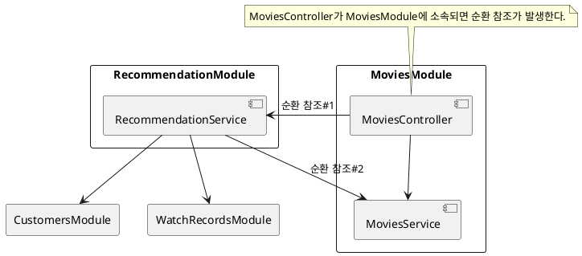
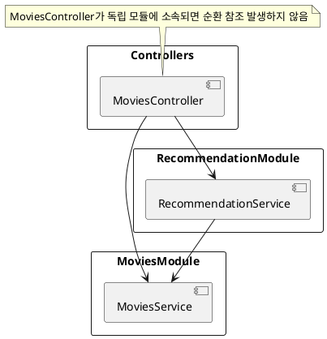

# Problems with Feature Modules

Nest에서 Controller, Service, 그리고 Repository가 모두 같은 모듈에 위치하는 구조를 "Feature Module" 구조라고 한다.
공식 문서의 설명이다.

> CatsController와 CatsService는 동일한 애플리케이션 도메인에 속합니다.
> 서로 밀접하게 연관되어 있으므로 기능 모듈로 이동하는 것이 좋습니다.
> 기능 모듈은 특정 기능과 관련된 코드를 간단히 정리하여 코드를 체계적으로 유지하고 명확한 경계를 설정합니다.
> 이는 특히 애플리케이션 및/또는 팀의 규모가 커짐에 따라 복잡성을 관리하고 SOLID 원칙에 따라 개발하는 데 도움이 됩니다.

그러나 Feature Module은 순환 참조 문제가 쉽게 발생할 수 있다.

## 모듈 간 순환 참조

다음과 같이 일반적인 영화 엔티티를 관리하기 위한 MoviesController가 있다고 가정하자.

```
GET /movies
GET /movies/{movieId}
```

여기에 고객에게 영화를 추천하는 REST API를 추가한다.

```
GET /movies/recommended
```

고객에게 영화를 추천하려면 고객이 관람한 영화 목록과 연령, 성별 등 다양한 정보를 알아야 한다. 이것을 MoviesService에서 처리하기 어렵기 때문에 RecommendationService를 만든다.

그러면 MoviesController는 두 개의 서비스를 참조하게 된다.

```ts
export class MoviesController {
    constructor(
        private moviesService: MoviesService,
        private recommendationService: RecommendationService
    ) {}
}
```

그런데 RecommendationService는 [MoviesService, CustomersService, WatchRecordsService]를 참조한다. 이 서비스를 모두 MoviesModule에서 참조하는 것은 부담스럽기 때문에 RecommendationService를 RecommendationModule로 옮긴다.

이런 상황에서 MoviesModule에 MovicesController와 MoviesService를 함께 정의하면 어떻게 될까?



RecommendationService와 MoviesService가 단방향 관계를 가지지만 MovieController와 MovieService가 MoviesModule로 묶여있기 때문에 모듈 레벨에서 순환 참조가 발생한다.

그래서 MoviesController를 포함한 모든 Controller들을 ControllersModule이라는 독립된 모듈로 정의한 것이다.




만약, Feature Modules를 고수하면서 순환 참조 문제를 피하고 싶다면 다음과 같이 별도의 REST API를 정의하고 해당 컨트롤러를 만들어야 한다.

```ts
// GET /recommendation/movies
export class RecommendationController {}
```

혹시 forwardRef를 사용하면 문제를 해결할 수 있다고 생각할지 모르겠다.

forwardRef는 설계 단계의 문제를 구현 단계에서 해결하는 방법에 지나지 않는다. 근본 문제를 해결하는 것이 아니기 때문에 forwardRef를 사용하면 결국 더 큰 문제를 일으키게 될 것이다.
